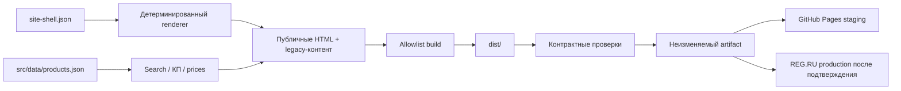

# Архитектура сайта

## Что есть сейчас

EGOE — статический сайт. Серверного приложения и единой базы данных в репозитории нет:

- HTML-категории и карточки находятся непосредственно в каталогах сайта;
- общие стили и логика находятся в `assets/css/` и `assets/js/`;
- поиск, КП и редактор цен читают разные представления одного товарного источника;
- корзина хранит состояние в браузере;
- формы и часть 3D-зависимостей используют внешние сервисы.

Поэтому одна ошибка в общем `site.js`, массовом генераторе или скопированном меню может проявиться на сотнях страниц. Защитный слой отделяет рабочие исходники от того, что физически разрешено публиковать.

Ни staging, ни production не должны получать файлы напрямую из корня Git-репозитория.

## Публичная граница

`tools/build-public-site.mjs` копирует только перечисленные публичные маршруты и runtime-ассеты. Служебные материалы исключаются по умолчанию. Новая папка не становится публичной случайно: её нужно осознанно добавить в allowlist и контракт.

Временное исключение — `/tools/dogovor/`. Несмотря на имя, это пользовательская страница, на которую ссылаются `/about/` и `/cart/`. На следующем архитектурном этапе её следует перенести в нормальный публичный маршрут без префикса `/tools/` и оставить редирект.

## Контракты

`config/site-contract.json` хранит:

- обязательные публичные маршруты;
- разрешённые источники сборки;
- запрещённые пути/шаблоны;
- точный baseline известных legacy-расхождений.

Baseline — не признание дефекта нормой. Он нужен, чтобы состояние нельзя было ухудшить незаметно. При целевом исправлении значение обновляется в том же PR с пояснением и тестом нового правила.

## Общий каркас страниц

Данные шапки, меню и подвала хранятся в `src/shared/site-shell.json`; разметку строит `tools/site-shell.mjs`. Команда `npm run sync:shell` обновляет только регионы между точными маркерами `EGOE:SITE_HEADER` и `EGOE:SITE_FOOTER`, не сериализуя и не переписывая остальной DOM.

Стандартный каркас применяется к 303 публичным страницам. `kp/index.html`, redirect `proizvodstvo/index.html` и standalone-приложение `tools/dogovor/index.html` перечислены как явные исключения в контракте. Корзина остаётся стандартной страницей, но её внутренний footer печатного КП защищён отдельной структурной проверкой.

Сгенерированные регионы не редактируются вручную. Изменение выполняется в data-файле или renderer-е, затем запускаются `npm run sync:shell` и полный `npm run check`.

Мобильное меню строится из уже сгенерированной шапки, включая brand и CTA, поэтому отдельной копии данных для mobile нет. Loader отклоняет отсутствующие поля, повторяющиеся маршруты, выход через `..` и небезопасные URL-протоколы; JS/MJS проходят синтаксическую проверку до сборки.

## Товарные данные

Канонический источник — `src/data/products.json`. В нём находятся 276 товаров, 11 определений категорий и отдельные 16 поисковых посадочных страниц. Из него детерминированно формируются:

- `assets/catalog.json` — 276 полных записей для КП;
- `assets/products.json` — 276 товаров + 16 посадочных страниц для поиска;
- `assets/data/prices.json` — 276 записей для закрытого редактора цен; этот файл не публикуется.

Разные количества больше не считаются рассинхронизацией сами по себе: они описывают разные grains. Контракт требует, чтобы товарная часть всех трёх представлений совпадала по SKU и URL, а посадочные страницы были перечислены явно. Схема запрещает дубли SKU/URL, внешние и выходящие из репозитория пути, несовместимые состояния цены и ссылки на отсутствующие ассеты.

`npm run sync:data` — единственный штатный способ обновить производные JSON. Старое имя `tools/build-catalog.mjs` оставлено как совместимая оболочка, но больше не парсит HTML обратно. Массовый импорт цен сначала изменяет канонический источник и только потом материализует цену в товарной странице и связанных карточках; абсолютные внешние CSV-пути удалены из процесса.

## Изоляция browser runtime

Общий `assets/js/site.js` пока остаётся одним legacy-файлом, но его 17 верхнеуровневых функций больше не запускаются общей незащищённой цепочкой. Каждая функция имеет стабильное имя и запускается через `window.EGOE_RUNTIME.run()`; значение общей viewport-утилиты создаётся через `value()` с безопасным fallback. Синхронное исключение или отклонённый Promise записывается в ограниченный журнал `EGOE_RUNTIME.failures()` и событие `egoe:runtime-error`, после чего следующий блок продолжает запускаться. Синтаксические ошибки не могут попасть в артефакт, потому что до сборки все JS/MJS проходят `node --check`.

Three.js остаётся внешней зависимостью, а GLB — локальным ассетом. Для обоих 3D-сцен установлен контракт: до 12 секунд на импорт движка и до 20 секунд на GLB/Draco. После ошибки или timeout loader завершается и показывает статичный чертёж с текстом «3D недоступно — показан чертёж»; бесконечного loader или анимированной подмены нет. Контракт проверяет все 75 Art Déco страниц, главную, порядок подключения скриптов и существование каждого GLB.

Общие `style.css`, `site.js`, `ad3d.js` и `fw3d.js` подключаются с версией из первых 12 символов SHA-256 собственного содержимого. `tools/sync-runtime-assets.mjs` меняет только соответствующие `href/src` в 303 стандартных страницах; `npm run build` отклоняет устаревшую версию. Это исключает ситуацию, когда production уже обновлён, а браузер ещё месяц использует закэшированный старый runtime.

## Этапы укрепления

### Этап 1 — защитный фундамент

- отдельный `dist`;
- allowlist вместо публикации корня;
- воспроизводимый manifest;
- CI и проверка ссылок/состава;
- документированный release flow;
- закрытая зона для будущих legal/RKN-материалов.

### Этап 2 — единые шаблоны и данные

- header, navigation и footer перенесены в единый renderer и data-файл;
- товары, цены и поисковый индекс перенесены в один канонический источник;
- вторичные JSON генерируются из источника, а не парсятся обратно из HTML;
- введены схема данных, уникальность SKU/URL и проверка 1 400+ ссылок на ассеты;
- устранена известная рассинхронизация пунктов меню и потребителей товарных данных.

### Этап 3 — изоляция runtime

- верхнеуровневые функции `site.js` изолированы именованным runtime guard;
- 3D-import и загрузка моделей ограничены timeout и конечным статичным fallback;
- следующий пакет — подтверждённая отправка форм и реальная политика вложений;
- физическое разделение legacy-файла по функциям/страницам выполняется отдельным PR после фиксации сценарных тестов;
- подтверждать фактическую отправку лидов до сообщения об успехе;
- определить реальную политику вложений;
- добавить browser smoke-тесты desktop/mobile для критических маршрутов.

### Этап 4 — контролируемый production

- публичные preview для PR;
- защита `main` обязательными checks;
- GitHub Environment с ручным approval;
- публикация на REG.RU только уже проверенного artifact;
- автоматический post-deploy smoke и документированный rollback.

## Что не следует делать

- не превращать первый этап в одновременный редизайн и переписывание всех страниц;
- не публиковать исходные инструменты «с исключениями на глаз»;
- не иметь несколько вручную поддерживаемых источников одних и тех же товаров;
- не считать успешную загрузку файлов доказательством работающего сайта — нужны контракты и smoke-проверки.
