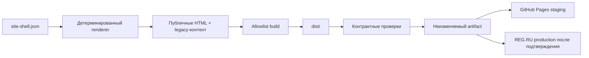

# Архитектура сайта

## Что есть сейчас

EGOE — статический сайт. Серверного приложения и единой базы данных в репозитории нет:

- HTML-категории и карточки находятся непосредственно в каталогах сайта;
- общие стили и логика находятся в `assets/css/` и `assets/js/`;
- поиск, КП и цены читают несколько JSON-источников;
- корзина хранит состояние в браузере;
- формы и часть 3D-зависимостей используют внешние сервисы.

Поэтому одна ошибка в общем `site.js`, массовом генераторе или скопированном меню может проявиться на сотнях страниц. Защитный слой отделяет рабочие исходники от того, что физически разрешено публиковать.

Ни staging, ни production не должны получать файлы напрямую из корня Git-репозитория.

## Публичная граница

`tools/build-public-site.mjs` копирует только перечисленные публичные маршруты и runtime-ассеты. Служебные материалы исключаются по умолчанию. Новая папка не становится публичной случайно: её нужно осознанно добавить в allowlist и контракт.

Временное исключение — `/tools/dogovor/`. Несмотря на имя, это пользовательская страница, на которую ссылаются `/about/` и `/cart/`. На следующем архитектурном этапе её следует перенести в нормальный публичный маршрут без префикса `/tools/` и оставить редирект.

## Контракты

`config/site-contract.json` хранит:

- обязательные публичные маршруты;
- разрешённые источники сборки;
- запрещённые пути/шаблоны;
- точный baseline известных legacy-расхождений.

Baseline — не признание дефекта нормой. Он нужен, чтобы состояние нельзя было ухудшить незаметно. При целевом исправлении значение обновляется в том же PR с пояснением и тестом нового правила.

## Общий каркас страниц

Данные шапки, меню и подвала хранятся в `src/shared/site-shell.json`; разметку строит `tools/site-shell.mjs`. Команда `npm run sync:shell` обновляет только регионы между точными маркерами `EGOE:SITE_HEADER` и `EGOE:SITE_FOOTER`, не сериализуя и не переписывая остальной DOM.

Стандартный каркас применяется к 303 публичным страницам. `kp/index.html`, redirect `proizvodstvo/index.html` и standalone-приложение `tools/dogovor/index.html` перечислены как явные исключения в контракте. Корзина остаётся стандартной страницей, но её внутренний footer печатного КП защищён отдельной структурной проверкой.

Сгенерированные регионы не редактируются вручную. Изменение выполняется в data-файле или renderer-е, затем запускаются `npm run sync:shell` и полный `npm run check`.

Мобильное меню строится из уже сгенерированной шапки, включая brand и CTA, поэтому отдельной копии данных для mobile нет. Loader отклоняет отсутствующие поля, повторяющиеся маршруты, выход через `..` и небезопасные URL-протоколы; JS/MJS проходят синтаксическую проверку до сборки.

## Этапы укрепления

### Этап 1 — защитный фундамент

- отдельный `dist`;
- allowlist вместо публикации корня;
- воспроизводимый manifest;
- CI и проверка ссылок/состава;
- документированный release flow;
- закрытая зона для будущих legal/RKN-материалов.

### Этап 2 — единые шаблоны и данные

- header, navigation и footer перенесены в единый renderer и data-файл;
- сделать один канонический источник товаров, цен и поискового индекса;
- генерировать HTML и вторичные JSON из источника, а не парсить HTML обратно;
- ввести схему данных и проверку уникальности SKU/URL;
- устранить известную рассинхронизацию пунктов меню.

### Этап 3 — изоляция runtime

- разделить монолитный `site.js` по функциям/страницам;
- подтверждать фактическую отправку лидов до сообщения об успехе;
- определить реальную политику вложений;
- добавить fallback/timeout для внешних 3D-зависимостей;
- добавить browser smoke-тесты desktop/mobile для критических маршрутов.

### Этап 4 — контролируемый production

- публичные preview для PR;
- защита `main` обязательными checks;
- GitHub Environment с ручным approval;
- публикация на REG.RU только уже проверенного artifact;
- автоматический post-deploy smoke и документированный rollback.

## Что не следует делать

- не превращать первый этап в одновременный редизайн и переписывание всех страниц;
- не публиковать исходные инструменты «с исключениями на глаз»;
- не иметь несколько вручную поддерживаемых источников одних и тех же товаров;
- не считать успешную загрузку файлов доказательством работающего сайта — нужны контракты и smoke-проверки.
